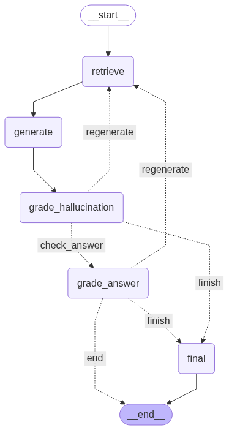

# GPU Data Science Tutor - Self-Corrective RAG System

A comprehensive Retrieval-Augmented Generation (RAG) system specifically designed for GPU-accelerated data science education. The system combines web documentation, Jupyter notebooks, and Python code examples to provide accurate, well-cited responses about CUDA programming, RAPIDS, PyTorch, TensorFlow, and other GPU computing frameworks.

## 🤝 Contributors  
[⚙️ Soham Sarkar](mailto:ssarka30@asu.edu)1,  [⚙️ Omik Save](mailto:osave@asu.edu)2,  [📁 Arjun Shilamkoti](mailto:ashilamk@asu.edu)3  

1 Developer, School of Electrical, Computer and Energy Engineering, Arizona State University  
2 Developer, School for Engineering of Matter, Transport, and Energy, Arizona State University  
3 Content Manager, W. P. Carey School of Business, Arizona State University

## 🚀 Features

### 🔍 Multi-Source Knowledge Base
- Loads 90+ GPU data science URLs from CSV
- Integrates Jupyter notebooks (.ipynb) and Python files (.py)
- Supports mixed citation formats for different source types

### 🧠 Self-Corrective RAG Pipeline
- **Enhanced Retrieval**: Multi-attempt document retrieval with relevance grading
- **Hallucination Detection**: Validates responses against source material
- **Answer Quality Assessment**: Ensures responses adequately address questions
- **Automatic Regeneration**: Improves responses through iterative refinement
- **Verified Sources**: Cites the sources used in content creation from the knowledge base

### 📚 Intelligent Citation System
- Numbered citations [1], [2], [3] with proper source attribution
- Reference validation to prevent hallucinated sources
- Automatic reference section generation

### 💬 Conversation Management
- Chat history tracking for follow-up questions
- Context-aware response generation
- Document exclusion to prevent repetitive retrievals

## 🛠️ System Architecture

## 📁 Project Structure

| File / Folder | Description |
|---------------|-------------|
| [`README.md`](./README.md) | You're here! This file describes the project, components, and how to get started. |
| [`rag_self_corrective.ipynb`](./rag_self_corrective.ipynb) | 🔧 **Main Jupyter Notebook** – Core implementation of the RAG-based chat interface with self-reflection and answer validation. |
| [`rag_compare_models_naive_rag_vs_base_model.ipynb`](./rag_compare_models_naive_rag_vs_base_model.ipynb) | 🔧 First implementation comparing LLama3 8B base model and RAG-based model. |
| [`requirements.txt`](./requirements.txt) | 📦 Python dependencies required to run the notebook and supporting code. |
| [`gpu_data_science_urls.txt`](./gpu_data_science_urls.txt) | 🌐 List of curated URLs used as the knowledge base for retrieval (GPU and data science related). |
| [`resources/`](./resources/) | 📚 Supplementary files, documents, and articles used for building or augmenting the knowledge base. |

---

